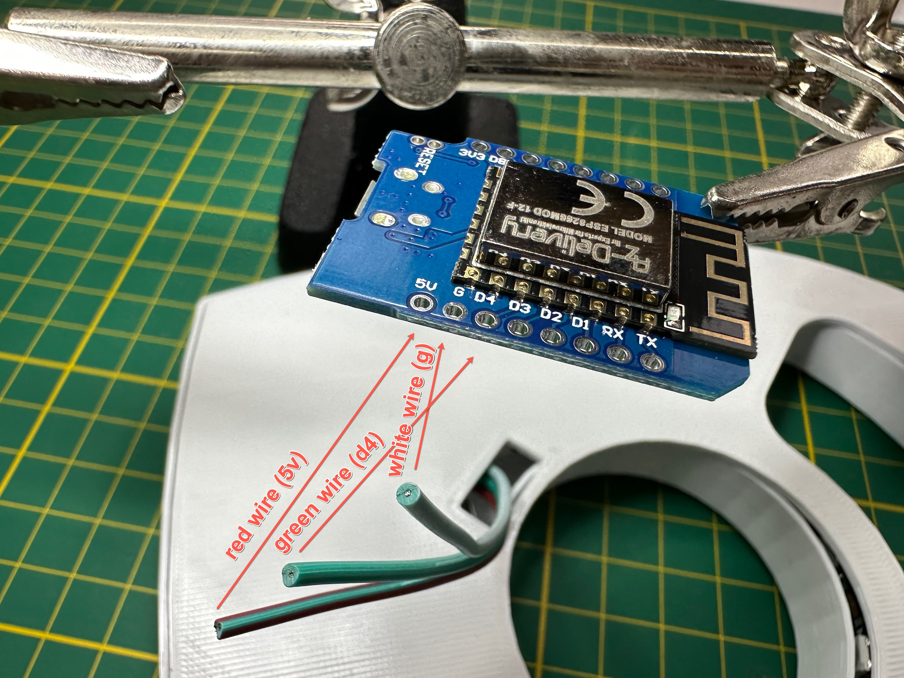

# Sentinel lamp
A 3D printable Sentinel wifi enabled smart light powered by [WLED](https://kno.wled.ge/) and compatible with [Home Assistant](https://www.home-assistant.io/)

### Components

To build the Sentinel lamp, you'll need access to a 3D printer, soldering iron and the following components:

- [Black PLA Filament](https://www.123-3d.nl/3D-filament/Filamenttype/1-75-mm-filament/1-75-mm-PLA/Zwart-p12162.html) (for the base) 
- [White PLA Filament](https://www.123-3d.nl/3D-filament/Filamenttype/1-75-mm-filament/1-75-mm-PLA/Wit-p12163.html)
- [WS2812B LED Strip](https://www.amazon.nl/dp/B08T8BZ6LG), 60 LED's per meter, just under 2m worth but usually sold in spools of 5m
- [ESP8266 NodeMCU D1 Mini Module](https://www.amazon.nl/AZDelivery-D1-Mini-ESP8266-12F-WLAN-Module/dp/B0754N794H/)
- [USB lead](https://www.amazon.nl/Maclean-MCE473-oplaadkabel-aansluitkabel-gegevensoverdracht/dp/B08QZ2MXHT) (Micro or Type-C depending on the model of D1 Mini you have purchased, usually Micro-USB) 

Assuming you already have the PLA filament and a spare USB lead, the construction cost for the electrical components works out at less than EUR 20 per lamp.

### Instructions

The lamp itself consists of 3 printable parts, printed in regular PLA on a printer with greater than a 210mmx210mm print bed (this was tested with an [Ender 3 S1 Pro](https://www.creality.com/products/creality-ender-3-s1-pro-fdm-3d-printer))

All models are designed to be printed without supports. 

The 3 components are:
- [Black base](models/sentinel_lamp_back_cover_black.stl)
- [White reflector](models/sentinel_lamp_reflector_white.stl)
- [White inner](models/sentinel_lamp_inner_whiter.stl)

When constructed they snap-fit together as shown.

When you have assembled your 3d printed parts you can begin contruction.

#### Step 1 - Install WLED

First, you'll want to flash your D1 Mini device with [WLED](https://kno.wled.ge/) and then configure it to connect to your WiFi network. the [WLED project](https://kno.wled.ge/) is an open source firmware for many embedded devices that allow you to create beatiful LED displays and network them together. There are controller apps for iOS and Android and it is also fully compatible with the popular [Home Assistant](https://www.home-assistant.io/) software meaning that once built you can control your lamp from anywhere and build any number of automations so that it flashes when someone stars your GitHub repo, changes color when your build breaks or switches on and off with your office lights. 

Note that for large LED displays you can need significant power, you'll also likely want a controller that has a level shifter to send a reliable 5v signal for data to your LED strip. However as we're only powering 100 or so LED's you can get away with pulling the power and data directly from the pins of an inexpensive D1 Mini.

The quickest and easiest way to install WLED on your D1 mini is to plug it into the USB socket on your computer and then visit the [WLED web installer site](https://install.wled.me/).

- [https://install.wled.me/](https://install.wled.me/)

Flash the device with the latest build of WLED, configure the device to connect to your WiFi network and then you are ready to go.

#### Step 2 - Stick the LED Strip to the White Inner

The White Inner component acts as the guide for the flexible LED strip as well as the diffuser for the lights which are stuck to the side. You only need the +5v, G and Data pins so snip off any additional power lines that might come with your strip or solder on new wires to the strip if yours didn't come with pre-soldered wires.  Remove the plastic from the adhesive backing and start sticking at the bottom middle, looping around the outside then over to the inside and finally around the central part. Cut at the marked lines when you are finally done.

When finished you should have around 100 LED's in your lamp, but it's worth counting at this point as you'll need the exact number later.

#### Step 3 - Add the Reflector
Next, feed the wires through the hole in the reflector. If you are using plugs to connect your strip and controller then you can do this at any time but if you are soldering the strip directly to the controller then you need to do it now.

#### Step 4 - Solder LED Strip to D1 Mini
Rather than use plugs, I solder my strip directly to my D1 Mini. Solder the red power wire to the 5V hole, the white ground wire to the G hole and the green data wire to the D4 hole.

#### Step 5 - Assemble
Next up, feed your USB lead through the back of the black outer body and connect it to your D1 Mini.  Place the D1 Mini in the small inlaid portion in the center of the lamp. Then drop in the relfector and finally place the white inner onto it, and snap fit into the black outer body. This should force the white reflector down which then also secures the electronics in place.  Power up your device and at this point about half of your LED's should be glowing orange.

#### Step 6 - Connect to WLED and configure display
All the rest of the configuration is configuring WLED for your device.  Connect using the IP address from installation time, then go to Config, LED Preferences and update the Length of the LED strip to be the number of LED's you installed in Step 2 (for me that's typically between 99 - 105).  When you press Save the rest of your LED's should be glowing orange.

You can now configure your light display with the amazing flexibility of WLED. Once you have your favorite setting, store it as a preset and then go back to the LED Preferences and scroll down to Defaults where you can set which preset it displayed when the lamp is powered on (i.e. Preset 1 instead of the default orange in Preset 0)

#### Step 7 - Share your makes!
That's it!  You are now done but I'd love to see pictures of your built and assembled lamps.  Feel free to share pictures of them [in discussions here](https://github.com/wortell/sentinel-lamp/discussions) or on social media and tag us on Twitter [@wortell](https://twitter.com/wortell) and other socials

### Credits

Big thanks to [Martin Woodward](https://github.com/martinwoodward/octolamp) for the inspiration, and the initial work on the GitHub Octocat lamp, and his GitHub repositories, that we have used as the basis for our design and approach.

